# Awesome-Cloud-Technical-Documentation-Support

# Awesome-Cloud-Technical-Documentation-Support 📚 🛠️

  

  

  

  

  

  

  

---

## 🌟 Top Cloud Technical Documentation & Support Ecosystem

**Curated List of Commercial Documentation Platforms & Open-Source Documentation Tools**  

*Focused on API Documentation, Developer Portals, Docs-as-Code, Knowledge Bases, Static Site Generators & Self-Hosted Documentation*

**Last updated: October 2026** 📅

---

### 📌 Overview & SEO Summary

Welcome to the ultimate curated directory of **cloud technical documentation platforms**, **open-source API documentation tools**, and **knowledge base frameworks**. Whether you are looking for enterprise-grade commercial solutions (such as *GitBook*, *Mintlify*, and *ReadMe*), or self-hostable open-source alternatives (like *Docusaurus*, *MkDocs*, and *Docsify*), this list covers category leaders, OpenAPI rendering, and privacy-respecting documentation infrastructure.

**Key Market Context:**

- **Mintlify** is the **fastest growing documentation platform** with **AI-native search and analytics**, used by **Anthropic, Perplexity, and Cursor**.

- **Docusaurus** remains the **most popular open-source documentation framework** with **60K+ GitHub stars**, powering **React Native, Prettier, and many others**.

- **OpenAPI/Swagger** has become the **universal standard for API documentation** — every modern platform renders OpenAPI specs.

---

## 📑 Table of Contents

- [🏢 SaaS & Commercial Platforms](#-saas--commercial-platforms)

- [🔓 Open-Source GitHub Projects](#-open-source-github-projects)

- [🛠️ How to Contribute](#%EF%B8%8F-how-to-contribute)

- [📊 Star History](#-star-history)

- [🤝 Support & Sponsorship](#-support--sponsorship)

- [⚠️ Disclaimer](#%EF%B8%8F-disclaimer)

---

## 🏢 SaaS / Commercial Platforms

The technical documentation and support market spans **docs-as-code platforms** (Mintlify, ReadMe, Redocly) that focus on **API documentation and developer portals**, **collaborative knowledge bases** (GitBook, Document360, Archbee) that serve **internal and external documentation**, and **API design platforms** (SwaggerHub, Stoplight) that combine **design, documentation, and governance**. **GitBook** charges **$8/user/month** for the Plus plan (annual) . **Mintlify** starts at **$150/month** for the Pro plan . **ReadMe** uses **custom pricing** with a **free tier for 3 users** . **Document360** starts at **$149/month** for the Standard plan . **Stoplight** starts at **$99/user/month** . **SwaggerHub** starts at **$75/month** for the Standard plan .

| SaaS / Commercial Platform | Company / Owner | Valuation / Market Cap | Standard Edition Starting Price | Free Tier / Free Trial Limits | Description |

| :--- | :--- | :--- | :--- | :--- | :--- |

| **[ReadMe](https://readme.com/)** 📖 | ReadMe | Private | **Free: 3 users**; **Paid: custom pricing**  | **Free: 3 users, 1 project, 1 API reference**  | **API documentation and developer hub** — **Interactive API reference** with "Try It" functionality . **Personalized documentation** based on user segments. **AI-powered search** and **analytics**. **The most widely used API documentation platform** by Twilio, Stripe, and GitHub . |

| **[GitBook](https://www.gitbook.com/)** 📘 | GitBook | Private | **Plus: $8/user/month** (annual); **Pro: $15/user/month**  | **Free: 1 user, 1 space**  | **Collaborative documentation platform** — **Docs-as-code with Git sync** . **AI-powered search and insights** . **GitBook Agent** for AI answering questions . **Used by Nextcloud, Gartner, and Duolingo** . |

| **[Mintlify](https://mintlify.com/)** 🌿 | Mintlify | Private | **Pro: $150/month**; **Enterprise: custom**  | **Free: 1 project, 1 user**  | **Modern documentation platform** — **The fastest growing docs platform** . **AI-native search and analytics**. **Used by Anthropic, Perplexity, and Cursor** . **Beautiful, modern design** with **built-in OpenAPI rendering** . |

| **[Stoplight](https://stoplight.io/)** 🚦 | Stoplight | Private | **$99/user/month** (Professional)  | **Free: 1 project, 1 user**  | **API design and documentation platform** — **Visual API designer** with **OpenAPI support**. **Automated style guides** and **API governance** . **The most comprehensive API design platform** . |

| **[SwaggerHub](https://swagger.io/tools/swaggerhub/)** 🎯 | SmartBear | Private | **$75/month** (Standard, 1 user)  | **Free: 1 API, 1 user**  | **API design and documentation** — **Built on OpenAPI/Swagger** . **Design, document, and deploy APIs** in one platform . **Team collaboration** and **API versioning** . **The original OpenAPI tooling platform** . |

| **[Redocly](https://redocly.com/)** 🔴 | Redocly | Private | **$99/month** (Starter)  | **Free: 1 user, 1 API**  | **API documentation platform** — **Best-in-class OpenAPI rendering** with **Redoc** . **API linting and governance** . **The most beautiful OpenAPI documentation renderer** . |

| **[Docusaurus (Commercial Support)](https://docusaurus.io/)** 🦖 | Meta | N/A (Open Source) | **Free** (open-source)  | **Open-source free forever**  | **Static site generator for documentation** — **The most popular open-source docs framework** with **60K+ GitHub stars** . **React-based with MDX support** . **Versioning, i18n, and search built-in** . **Used by React Native, Prettier, and more** . |

| **[Archbee](https://www.archbee.com/)** 🏗️ | Archbee | Private | **$50/user/month** (Startup)  | **Free: 3 users, 1 space**  | **Documentation platform** — **Modern editor with AI writing assistance** . **API documentation and OpenAPI support** . **Internal and external knowledge bases** . |

| **[Document360](https://document360.com/)** 📄 | Document360 | Private | **$149/month** (Standard, 5 users)  | **Free: 1 project, 5 users**  | **Knowledge base platform** — **Internal and external knowledge bases** . **AI-powered search and analytics** . **API documentation and versioning** . |

---

## 🔓 Open-Source GitHub Projects

*Sorted by GitHub_Stars_Count (Descending)* 🌟

- **[Docusaurus](https://github.com/facebook/docusaurus)**   

  **Static site generator for documentation**, MIT licensed. **The most popular open-source documentation framework** with **60K+ GitHub stars** . **React-based with MDX support** — write documentation in Markdown with JSX . **Versioning, i18n, and search built-in** . **Plugin architecture** for customization . **Used by React Native, Prettier, and thousands of other projects** . **The de facto standard for open-source documentation** . 🦖

- **[MkDocs](https://github.com/mkdocs/mkdocs)**   

  **Static site generator for project documentation**, BSD-2-Clause licensed. **Python-based with Markdown** . **YAML configuration** for simple setup . **Material for MkDocs** theme is the most popular documentation theme ever created . **The simplest open-source documentation framework** — build docs in minutes. 📘

- **[Docsify](https://github.com/docsifyjs/docsify)**   

  **Magic documentation site generator**, MIT licensed. **No build process** — write Markdown and Docsify renders it in the browser . **Single HTML file** for instant documentation . **The simplest way to create documentation** — no static site generation required . 🪄

- **[VuePress](https://github.com/vuejs/vuepress)**   

  **Vue-powered static site generator**, MIT licensed. **Vue-based with Markdown support** . **VuePress 2** supports Vue 3 and Vite . **Used by Vue.js and many other projects** . **The best documentation framework for Vue developers** . 💚

- **[VitePress](https://github.com/vuejs/vitepress)**   

  **Vite-powered static site generator**, MIT licensed. **Vue 3 + Vite** — lightning fast builds . **The successor to VuePress** with better performance . **Used by Vue.js, Vite, and many modern projects** . ⚡

- **[Material for MkDocs](https://github.com/squidfunk/mkdocs-material)**   

  **Technical documentation theme for MkDocs**, MIT licensed. **The most popular documentation theme ever created** . **Beautiful, modern design** with **dark mode, search, and i18n** . **Extensive customization** with **over 10K GitHub stars** . **The gold standard for documentation design** . 🎨

- **[Redoc](https://github.com/Redocly/redoc)**   

  **OpenAPI/Swagger-generated API reference documentation**, MIT licensed. **The most beautiful OpenAPI renderer** . **Three-panel design** with **request/response samples** . **Try-it functionality** for API testing . **Used by thousands of API documentation sites** . 🔴

- **[Swagger UI](https://github.com/swagger-api/swagger-ui)**   

  **Interactive API documentation from OpenAPI specs**, Apache-2.0 licensed. **The original OpenAPI documentation renderer** . **"Try It" functionality** for API exploration . **The most widely deployed API documentation tool** . 🎯

- **[Swagger Editor](https://github.com/swagger-api/swagger-editor)**   

  **OpenAPI spec editor**, Apache-2.0 licensed. **Real-time validation and preview** . **YAML and JSON support** . **The standard OpenAPI authoring tool** . ✏️

- **[BookStack](https://github.com/BookStackApp/BookStack)**   

  **Open-source knowledge management platform**, MIT licensed. **The most popular open-source wiki** . **Books, chapters, and pages** hierarchy . **WYSIWYG editor with Markdown support** . **Self-hosted alternative to Confluence** . 📚

- **[Outline](https://github.com/outline/outline)**   

  **Collaborative knowledge base**, BSL-1.1 licensed. **Notion-style wiki** . **Real-time collaboration** . **Self-hosted or cloud** . **The most modern open-source knowledge base** . 🏢

- **[Wiki.js](https://github.com/requarks/wiki)**   

  **Modern wiki application**, AGPL-3.0 licensed. **Beautiful UI with extensive features** . **Markdown support and versioning** . **The most feature-complete open-source wiki** . 📖

- **[Documenso](https://github.com/documenso/documenso)**   

  **Open-source DocuSign alternative**, AGPL-3.0 licensed. **Document signing and management** . **The most popular open-source document signing platform** — relevant for documentation approval workflows . ✍️

---

## 🛠️ How to Contribute

Contributions are welcome! Follow these steps to submit new documentation platforms or open-source documentation software:

1. 🍴 **Fork** the repository.

2. 📝 **Add/edit** entries in `README.md` maintaining table/list structure and formatting.

3. 🔗 Include project title, official website/GitHub link, exact Stars_Count, license, and brief description.

4. 🚀 Submit a **Pull Request** with a descriptive summary of your changes.

---

## 📊 Star History

---

## 🤝 Support & Sponsorship

If you find this technical documentation and support repository useful, please consider supporting the project:

- ⭐ **Star** this repository to increase visibility!

- 🔀 **Fork** and share with fellow developers, technical writers, and open-source advocates.

- ☕ **Sponsor & Buy Me a Coffee**: Support ongoing open-source curation via the [GitHub Sponsor Dashboard](https://github.com/sponsors/ishandutta2007).

---

## ⚠️ Disclaimer

- This is a **community-curated** list — not exhaustive and not an endorsement. ℹ️

- **Mintlify is the fastest growing documentation platform** with **AI-native search and analytics**, used by **Anthropic, Perplexity, and Cursor** . **Pro starts at $150/month** .

- **Docusaurus remains the most popular open-source documentation framework** with **60K+ GitHub stars**, powering **React Native, Prettier, and thousands of other projects** . **MIT licensed and free forever** .

- **GitBook is free for 1 user** — paid plans start at **$8/user/month** (annual) . **Document360 starts at $149/month** . **ReadMe offers a free tier for 3 users** .

- **Open-source documentation tools (Docusaurus, MkDocs, Docsify) are not turnkey** — they require **deployment, customization, and ongoing maintenance** . **Docusaurus requires React knowledge for advanced customization** . **MkDocs is the simplest to start with** . **Always validate documentation workflows with a proof-of-concept** before production deployment . 📚

---

  <b>Made with ❤️ for developers, technical writers, and open-source documentation advocates.</b>

